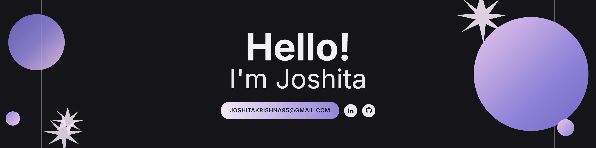

<div align="center">



</div>

```diff
+ > whoami
Software engineer · Singapore
+ > currently
Job search copilot (built with Hermes) · website revamp for an SME client
+ > studying
Master of IT in Business (Fintech & Analytics) @ SMU · BSc Computer Science (AI & Cyber Physical Systems) @ SMU
```

I spend most of my time shipping full-stack products and finding places to wire LLMs into workflows where they could add value. Right now that means building some tools for personal productivity and breaking things on the side for fun.


### what I've built

* 🧭 [Trailblazer](https://github.com/joshitaaa/trailblazer2024) — AI app recommending training paths based on your CV and career goals · Finalist in the Nomura Trailblazer Challenge
* 🎬 [ReelAlpha](https://github.com/joshitaaa/reelalpha) — shipped in a day at the H0 hackathon (Vercel + AWS tracks) → [reelalpha.vercel.app](https://reelalpha.vercel.app/)
* 🔐 [Quantum Security Auditor](https://github.com/joshitaaa/quantum-security-auditor) — scores payment encryption for quantum-readiness, simulates a Shor's algorithm attack, maps a migration path off RSA → [try it](https://quantum-security-auditor-isfs622.streamlit.app/)
* 📇 CRM — leads, client comms, and timesheets in one tool for an SME, with RBAC and an admin-configurable UI

### skills & tools

<p align="left">
<a href="https://aws.amazon.com" target="_blank" rel="noreferrer"></a>
<a href="https://www.cprogramming.com/" target="_blank" rel="noreferrer"></a>
<a href="https://www.docker.com/" target="_blank" rel="noreferrer"></a>
<a href="https://git-scm.com/" target="_blank" rel="noreferrer"></a>
<a href="https://www.java.com" target="_blank" rel="noreferrer"></a>
<a href="https://kubernetes.io" target="_blank" rel="noreferrer"></a>
<a href="https://www.linux.org/" target="_blank" rel="noreferrer"></a>
<a href="https://www.mongodb.com/" target="_blank" rel="noreferrer"></a>
<a href="https://www.mysql.com/" target="_blank" rel="noreferrer"></a>
<a href="https://nextjs.org/" target="_blank" rel="noreferrer"></a>
<a href="https://nodejs.org" target="_blank" rel="noreferrer"></a>
<a href="https://www.postgresql.org" target="_blank" rel="noreferrer"></a>
<a href="https://www.python.org" target="_blank" rel="noreferrer"></a>
<a href="https://pytorch.org/" target="_blank" rel="noreferrer"></a>
<a href="https://reactjs.org/" target="_blank" rel="noreferrer"></a>
<a href="https://spring.io/" target="_blank" rel="noreferrer"></a>
<a href="https://www.typescriptlang.org/" target="_blank" rel="noreferrer"></a>
<a href="https://vuejs.org/" target="_blank" rel="noreferrer"></a>
</p>

🏅 AWS Certified Solutions Architect (Associate) · Data Analytics (Coursera) · HTML/CSS (FreeCodeCamp)

📫 [joshitakrishna95@gmail.com](mailto:joshitakrishna95@gmail.com) · 💼 [LinkedIn](https://linkedin.com/in/joshita-krishna) · 🐙 [GitHub](https://github.com/joshitaaa)
